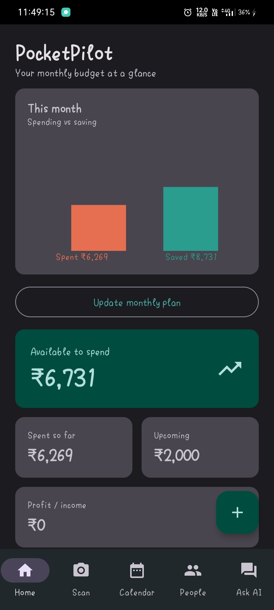
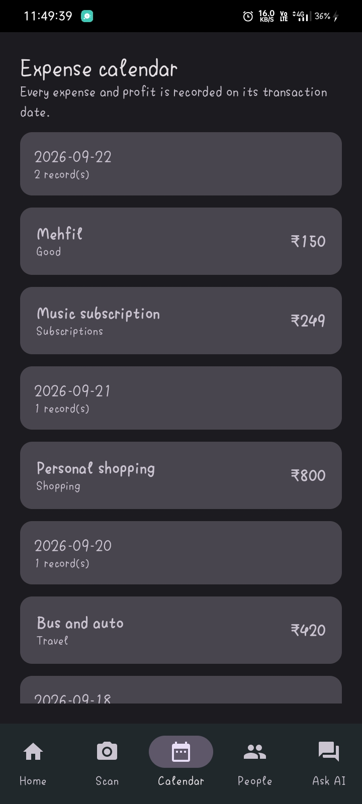
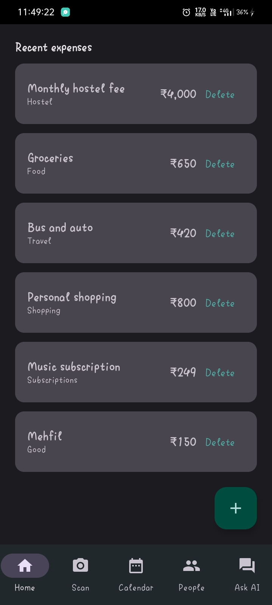
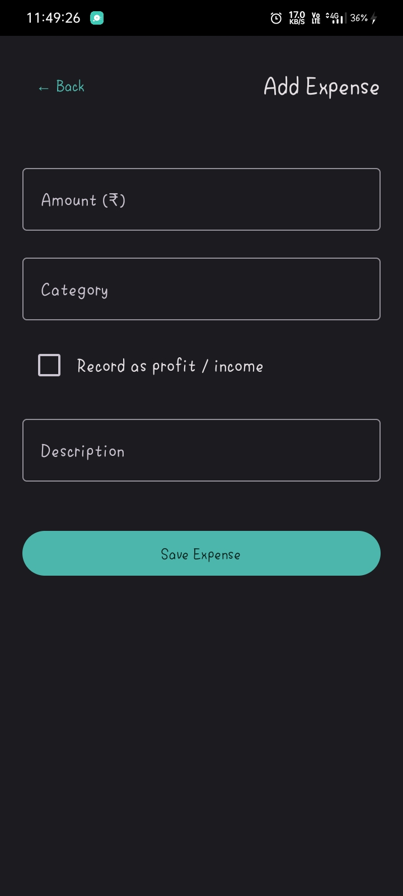
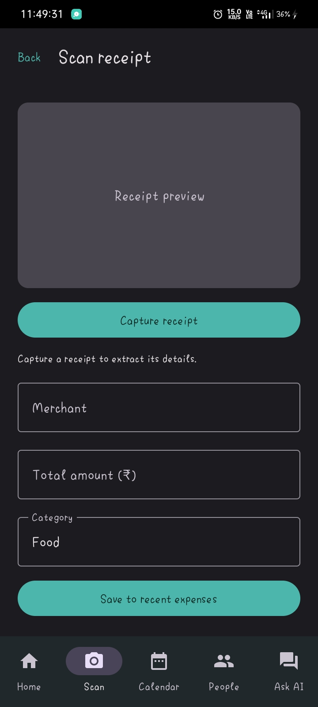
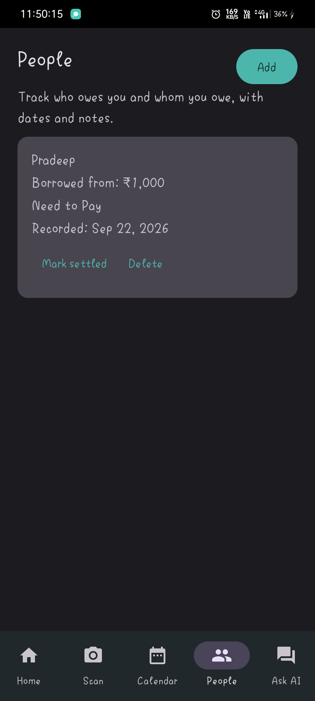
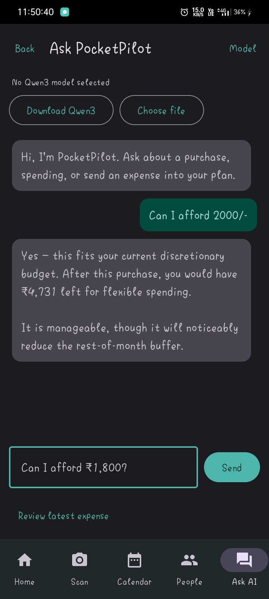

# PocketPilot ✈️💳

A phone-first AI financial assistant for Android, built with Kotlin and Jetpack Compose. PocketPilot helps you plan spending, record expenses and profits, scan receipts, track borrowings, and ask an on-device Qwen3 assistant for transparent what-if guidance.

---

## 🚀 Features

- **Monthly plan:** Set income and upcoming commitments; the available-to-spend figure updates instantly.
- **Expense and profit tracking:** Record expenses or income/profit manually, with category, description, merchant, date, and amount.
- **Receipt scanning:** Capture a receipt, run on-device OCR, review the detected merchant/category/total, and save the receipt image.
- **Expense calendar:** Browse expense and profit records grouped by their transaction date.
- **Expense details:** Open any recent record to review its date, merchant, category, amount, and receipt image.
- **Borrow and loan tracking:** Track who owes you or whom you owe, including person, amount, type, notes, date, and settlement status.
- **Qwen3 AI assistant:** Download the Qwen3 GGUF model directly from the Ask AI screen, or import a local GGUF file, then ask affordability and spending questions on-device.
- **Offline-first finance data:** Expenses, profits, people, loans, and plan settings persist locally in Room. The optional model download requires Internet access.

---

## 🛠️ Tech Stack

- **Language:** [Kotlin](https://kotlinlang.org/)
- **UI Framework:** [Jetpack Compose](https://developer.android.com/jetpack/compose) (Material 3)
- **Database:** [Room Database](https://developer.android.com/training/data-storage/room)
- **Asynchronous Data:** [Kotlin Coroutines](https://kotlinlang.org/docs/coroutines-overview.html) and [Flow / StateFlow](https://kotlinlang.org/docs/flow.html)
- **AI runtime:** llama.cpp with a Qwen3 GGUF model
- **OCR:** Google ML Kit Text Recognition
- **Architecture:** MVVM (Model-View-ViewModel)
- **Min SDK:** API 24 (Android 7.0)
- **Target SDK:** API 33 (Android 13.0)

---

## 📁 Project Structure

```text
com.pocketpilot.app/
├── data/
│   ├── local/
│   │   ├── AppDatabase.kt        # Room database and migrations
│   │   ├── ExpenseDao.kt         # Expense, date, and profit queries
│   │   ├── ExpenseEntity.kt      # Expense/profit record schema
│   │   ├── LoanDao.kt            # Borrowing and loan queries
│   │   └── LoanEntity.kt         # Person transaction schema
│   └── repository/
│       ├── ExpenseRepository.kt  # Expense data access
│       └── LoanRepository.kt     # Borrowing and loan data access
├── domain/
│   └── Qwen3Assistant.kt         # Model download, import, and inference
├── ui/
│   └── screens/
│       ├── HomeScreen.kt            # Budget dashboard
│       ├── CalendarScreen.kt        # Date-grouped records
│       ├── ExpenseDetailScreen.kt   # Full expense/receipt details
│       ├── PeopleScreen.kt          # Borrow and loan tracking
│       ├── ScanReceiptScreen.kt     # Camera and OCR workflow
│       └── AskPocketPilotScreen.kt  # Qwen3 assistant
├── viewmodel/
│   └── ExpenseViewModel.kt        # State management and UI logic
└── MainActivity.kt                # App entry point
```

## Run it

1. Open the project in Android Studio.
2. Select an Android emulator or a physical device running Android 7.0+.
3. Press **Run**. Grant camera permission when using receipt capture.
4. On Home, set the monthly plan, add an expense or profit, then try the Scan, Calendar, People, and Ask AI tabs.
5. On **Ask AI**, tap **Download Qwen3** to download and load the model inside the app. The first download is large and requires an Internet connection.

## Demo script

1. Update the monthly plan to ₹15,000 income and ₹2,000 upcoming commitments.
2. Scan a receipt, review its fields, and save it as Food.
3. Add a profit/income record and confirm the updated profit summary.
4. Open Calendar to review records by date, then open a recent expense for its full details.
5. Add a person with a borrowed amount, note, and settlement status in People.
6. Ask: “Can I afford ₹1,800?” and show the remaining buffer and impact.
7. Download Qwen3 from Ask AI and ask: “How much did I spend on food?”

## Screenshots

### Home dashboard



### Expense calendar



### Recent expenses



### Add an expense or profit



### Scan a receipt



### Borrow and loan tracking



### Ask PocketPilot AI


